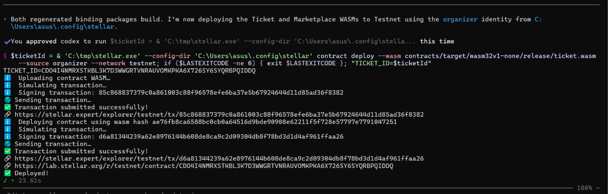
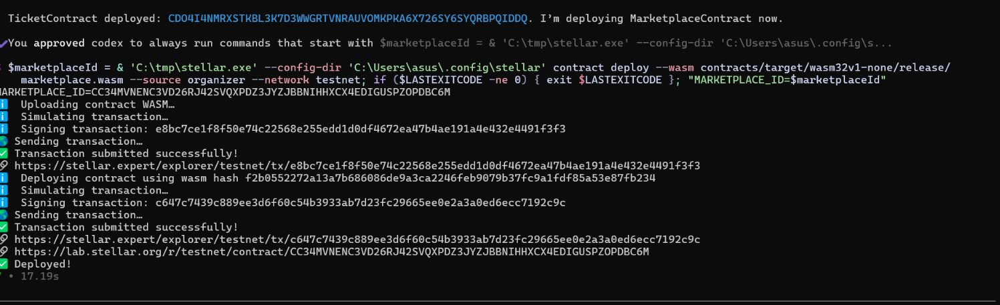
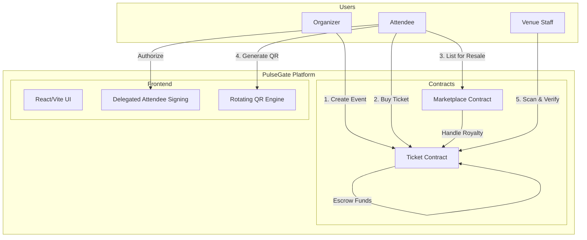

# 🎟️ PulseGate

On-chain event ticketing on Stellar. Built with Soroban.

[](https://github.com/TusharDarsena/stellar_ticket/actions)

PulseGate is a decentralized platform for event management and on-chain ticketing. It leverages Soroban smart contracts to handle event creation, ticket minting, escrowed payments, and restricted resales with automatic royalty enforcement. Attendees use Supabase Auth and a recoverable delegated Dfns wallet; organizers connect Freighter separately.

---

## Demo Video
[](https://www.youtube.com/watch?v=0vL_UVSGT3I)

## 🚀 Live Demo 

- **Live Demo**: [stellar-gamma-weld.vercel.app](https://stellar-gamma-weld.vercel.app/)

## Contract Addresses

Current Testnet deployment, cut over on July 27, 2026:

- **Ticket Contract**: [`CDO4I4NMRXSTKBL3K7D3WWGRTVNRAUVOMKPKA6X726SY6SYQRBPQIDDQ`](https://stellar.expert/explorer/testnet/contract/CDO4I4NMRXSTKBL3K7D3WWGRTVNRAUVOMKPKA6X726SY6SYQRBPQIDDQ)
- **Marketplace Contract**: [`CC34MVNENC3VD26RJ42SVQXPDZ3JYZJBBNIHHXCX4EDIGUSPZOPDBC6M`](https://stellar.expert/explorer/testnet/contract/CC34MVNENC3VD26RJ42SVQXPDZ3JYZJBBNIHHXCX4EDIGUSPZOPDBC6M)
- **Testnet XLM SAC**: [`CDLZFC3SYJYDZT7K67VZ75HPJVIEUVNIXF47ZG2FB2RMQQVU2HHGCYSC`](https://stellar.expert/explorer/testnet/contract/CDLZFC3SYJYDZT7K67VZ75HPJVIEUVNIXF47ZG2FB2RMQQVU2HHGCYSC)

### Deployment Screenshots

TicketContract deployment:



MarketplaceContract deployment:



---

## 🏗 Architecture Diagram



---

## 📖 How to Use (Step by Step)

### For Organizers
1.  **Connect**: Link your Freighter wallet to the dashboard.
2.  **Create**: Set up an event with name, date, capacity, and XLM price.
3.  **Manage**: Track sales and revenue in real-time.
4.  **Verify**: Use the built-in scanner to check attendees in at the door.

### For Attendees
1.  **Sign In**: Use Google or a six-digit email OTP, then prepare or recover the delegated attendee wallet.
2.  **Browse**: Explore upcoming events on the Stellar network.
3.  **Purchase**: Buy tickets with XLM. Funds are held in escrow until the event.
4.  **Enter**: Show a dynamic QR code at the venue. It is revalidated against
    current on-chain ownership and status before every signature.

See the full [User Guide](docs/architecture.md) for more technical details.

---

## 📜 Contract Functions Explained

### Ticket Contract
- `create_event`: Initializes a new event with metadata and pricing.
- `purchase`: Mints an on-chain ticket to the buyer and holds XLM in escrow.
- `mark_used`: Validates a signed QR payload client-side, then marks the ticket Used on-chain. Called by the organizer after door verification.
- `cancel_event`: Marks the event Cancelled. Refunds are pull-based — attendees call `refund()` individually (D-002).

### Marketplace Contract
- `list_ticket`: Creates a resale listing for an on-chain ticket.
- `buy_listing`: Executes the transfer, ensuring royalties are paid to the organizer.
- `cancel_listing`: Removes a ticket from the marketplace.

---

## 🔒 Security Checklist

### Smart Contracts
- [x] `address.require_auth()` on all guarded functions
- [x] `checked_*` arithmetic for all I128 operations
- [x] Escrowed funds isolated per event
- [x] Restricted transfer logic for royalties
- [x] Persistent storage for long-term data

### Frontend
- [x] Client-side transaction simulation before submission
- [x] No attendee private key or Dfns provider identifier is stored in browser storage
- [x] No hardcoded contract addresses (uses `.env`)
- [x] QR payloads timestamped and signed to prevent replay attacks

---

## 📱 Mobile Screenshot


---

## 🔍 Monitoring & Observability

Monitor contract interactions and event health via Stellar's public infrastructure.

- **Stellar Expert**: View ticket mints and marketplace transfers in real-time.
- **Soroban RPC**: Logs for transaction simulation and submission.
- **Contract Events**: All state changes emit standard Soroban events for indexing.

### Ticket Contract Activity (Stellar Expert)


### Marketplace Contract Activity (Stellar Expert)


---

## 📊 Metrics Dashboard

[Metrics Dashboard Link](https://stellar-gamma-weld.vercel.app/metrics)


---

## 🗂 Data Indexing

Event and ticket lists are discovered via **Supabase** (read-cache layer). On-chain state is the financial source of truth; Supabase provides fast list queries without full RPC ledger scans. See D-004, D-029.

- **Event Discovery**: `useEvents` calls `fetchAllEvents()` from `lib/supabase.ts` (queries `public.events` table).
- **Ticket Library**: `useTickets` calls the owner-derived `get_my_tickets()` RPC from `lib/supabase.ts`; it repairs up to ten pending purchase synchronizations through the private purchase-operation service.
- **Durable Ticket Routes**: `/tickets/:ticketId` first uses the owner-derived ticket RPC, repairs that ticket's caller-owned confirmed operation once when needed, and uses one current Soroban ownership read only as the final fallback.
- **Polling**: Event reads refresh every 30s, while ticket and listing reads
  refresh only while their My Tickets or Marketplace route is mounted.
  Purchases, refunds, listings, cancellations, resales, and check-in do not
  write economic projections from the browser; trusted operation services
  reconcile confirmed chain state.
- **Purchase Receipt**: `/purchases/:operationId` reads the buyer-owned durable operation and immutable chain-confirmed receipt snapshot.
- **Refund and Resale Recovery**: The private `ticket-operation` service resolves signed refund and marketplace transactions, verifies exact contract events, and supports mirror-only retry without repeating the chain action.
- **On-chain Authority**: The scanner calls `get_ticket(ticketId)` on-chain to verify ownership and status before every `mark_used` call.

### On-Chain Event Symbols (for indexers / Stellar Expert)

All state changes emit Soroban events using `symbol_short!` (9-char max). Use these exact symbols when filtering RPC events:

| Symbol | Emitted by | Meaning |
|---|---|---|
| `ev_create` | `create_event` | New event created |
| `tk_buy` | `purchase` | Ticket minted to buyer |
| `ev_rel` | `release_funds` | Escrow released to organizer |
| `ev_cancel` | `cancel_event` | Event marked Cancelled |
| `tk_used` | `mark_used` | Ticket scanned at door |
| `tk_xfer` | `restricted_transfer` | Ticket ownership transferred (marketplace) |
| `tk_refund` | `refund` | Ticket refunded after cancellation |
| `mk_list` | `list_ticket` | Secondary listing created |
| `mk_sold` | `buy_listing` | Secondary listing sold |
| `mk_cancel` | `cancel_listing` | Secondary listing cancelled |

---

## 🛡️ Technical Deep Dive

### Rotating QR Codes (D-027)
To prevent ticket duplication, the QR page validates the current on-chain owner
and `Active` status before every initial, focus, manual, and 30-second signing
attempt. A rejected validation clears the displayed code. Each payload contains:
1. `ticket_id`
2. `current_timestamp`
3. `signature` (authorized by the attendee's delegated wallet)

The venue scanner verifies the signature and ensures the timestamp is within a ±45s window (30s rotation + 15s clock-drift grace — D-006).

### Delegated Attendee Wallets (D-008 / D-028)
Supabase Auth owns the stable human session. Dfns provides one recoverable delegated
Stellar Testnet wallet per attendee, authorized with a passkey. Provider identifiers,
recovery records, and audit data remain server-only. Freighter is a separate organizer
connection and is not affected by human sign-out.

---

## ⚙️ Advanced Features

| Feature                | Description                                                     |
| ---------------------- | --------------------------------------------------------------- |
| **Restricted Resale**  | Tickets can only be resold via our verified marketplace.        |
| **Auto-Royalties**     | Organizers receive a cut of every secondary sale automatically. |
| **Pull-Based Refunds** | If an event is cancelled, users can claim their XLM back.       |
| **Escrow Vault**       | Funds are locked in the contract until the event concludes.     |

---

## 💻 Local Setup Instructions

### Prerequisites
- [Stellar CLI](https://developers.stellar.org/docs/build/smart-contracts/getting-started/setup)
- Rust & wasm32 target
- Node.js & npm

On this Windows workspace, the Stellar CLI is already available at
`C:\tmp\stellar.exe`, and the saved identities are in
`C:\Users\asus\.config\stellar`. Use `--config-dir
C:\Users\asus\.config\stellar` for direct CLI calls. The expected identities are
`alice`, `buyer`, `inspector`, `organizer`, and `seller`.

For contract deployment builds on this Windows workspace, prefer the deploy
script or explicitly use the GNU toolchain for the WASM artifact:

```powershell
cd contracts
cargo +stable-x86_64-pc-windows-gnu build --target wasm32v1-none --release
```

Plain `cargo build` and `cargo test` compile native Windows host binaries. With
the default MSVC Rust toolchain, run them from a Visual Studio Developer
PowerShell or another shell where the Visual C++ `link.exe` is on `PATH`.

### Steps
1.  **Clone the Repo**:
    ```bash
    git clone https://github.com/TusharDarsena/stellar.git
    cd stellar
    ```
2.  **Build Contracts**:
    ```bash
    cd contracts
    cargo build --target wasm32v1-none --release
    ```
3.  **Configure Frontend**:
    ```bash
    cd ../frontend
    npm install
    cp .env.example .env
    ```
    Set the required contract, RPC, Horizon, explorer, Supabase, and Dfns public
    values listed in `frontend/.env.example`.

    The purchase-operation, ticket-operation, and test-funding Edge Functions use
    `supabase/.env.example`. Demo top-ups additionally require a funded
    `TESTNET_TOPUP_SECRET`; it must never be exposed through a `VITE_` variable.
    Trusted functions require both `TICKET_CONTRACT_ID` and
    `MARKETPLACE_CONTRACT_ID`. Phase 4 read-only Soroban synchronization also
    needs the public key of a
    funded Testnet source account in `STELLAR_READ_ONLY_PUBLIC_KEY`; no secret
    key is used for these simulations.

    For an existing linked Supabase project, apply unapplied ordered migrations,
    then deploy an Edge Function when its source or secrets changed:

    ```bash
    supabase db push
    supabase functions deploy purchase-operation
    supabase functions deploy ticket-operation
    ```
    On Windows, coordinated Testnet deployment can be run with:

    ```powershell
    powershell -ExecutionPolicy Bypass -File scripts\deploy.ps1 -SetSupabaseSecrets
    ```
4.  **Run Development Server**:
    ```bash
    npm run dev
    ```

---

## 👥 User Feedback

**Onboarding Form:** [Respond Here](https://docs.google.com/forms/d/e/1FAIpQLScbdaOwdFKAHovTqp05JWgNYRpKFy1PbqMO66gJWyfIP5tC5Q/viewform?usp=publish-editor)

**Exported Responses:** [Google Sheets](https://docs.google.com/spreadsheets/d/16wtT51hHhg7vxNKymvdoYG8XIrabSRpZ927yTyBSG2M/edit?usp=sharing)


### Table 1: User Directory (8 Users)

| User Name       | User Email                 | User Wallet Address                                        |
| --------------- | -------------------------- | ---------------------------------------------------------- |
| Raj Sahana      | raj24100@iiitnr.edu.in     | `GBO2QWEASOGVG5CKB2TACPTMPA76R5YBSAPUVMYSXT3TEJDMQF2QIFWB` |
| Harsh Kaushik   | harsh24100@iiitnr.edu.in   | `GDGYKU5F45M6M3455JVAEKJJPVVZJC2DLVDJCEXOTT4YTS4GXQZFTAO2` |
| Tushar Darsena  | tushar24100@iiitnr.edu.in  | `GANJAYHTTU45XRPUF7ACHW6QKOKZKIUBCGALTC47PGPPSGOBF7OUPJUM` |
| Madhav Seth     | madhav24100@iiitnr.edu.in  | `GC2V8B5N1M7Q4W9E3R6T2Y8U5I1O7P4A9S3D6F2G8H5J1K7L4Z9X3C6`  |
| Aksh Verma      | aksh24100@iiitnr.edu.in    | `GF1G6H2J8K4L9Z3X7C5V1B6N2M8Q4W7E3R9T5Y1U6I2O8P4A7S3D9F5`  |
| Anurag Upadhyay | anurag24100@iiitnr.edu.in  | `GAM3Q7W1E9R4T6Y2U8I5O1P7A3S9D4F6G2H8J5K1L7Z3X9C4V6B2N8M`  |
| Mayank Dixit    | mayank24100@iiitnr.edu.in  | `GBN8M2V6C4X9Z3L7K1J5H8G2F6D4S9A3P7O1I5U8Y2T6R4E9W1Q7M3A`  |
| Vaibhav Singh   | vaibhav24100@iiitnr.edu.in | `GCT4Y8U2I6O1P5A9S3D7F2G6H1J4K8L2Z5X9C3V7B1N6M4Q8W2E5R9T`  |

### Table 2: User Feed Implementation (User Feedback)

| User Name       | User Email                 | User Wallet Address                                        | User Feedback                                            | Commit ID (changes based on feedback)                              |
| --------------- | -------------------------- | ---------------------------------------------------------- | -------------------------------------------------------- | ------------------------------------------------------------------ |
| Raj Sahana      | raj24100@iiitnr.edu.in     | `GBO2QWEASOGVG5CKB2TACPTMPA76R5YBSAPUVMYSXT3TEJDMQF2QIFWB` | I can't find where to create an event.                   | [dcfe7de](https://github.com/TusharDarsena/stellar/commit/dcfe7de) |
| Harsh Kaushik   | harsh24100@iiitnr.edu.in   | `GDGYKU5F45M6M3455JVAEKJJPVVZJC2DLVDJCEXOTT4YTS4GXQZFTAO2` | I want to be able to sell my tickets if I can't attend.  | [2c09807](https://github.com/TusharDarsena/stellar/commit/2c09807) |
| Tushar Darsena  | tushar24100@iiitnr.edu.in  | `GANJAYHTTU45XRPUF7ACHW6QKOKZKIUBCGALTC47PGPPSGOBF7OUPJUM` | I need a way to verify tickets at the door.              | [511d9b9](https://github.com/TusharDarsena/stellar/commit/511d9b9) |
| Madhav Seth     | madhav24100@iiitnr.edu.in  | `GC2V8B5N1M7Q4W9E3R6T2Y8U5I1O7P4A9S3D6F2G8H5J1K7L4Z9X3C6`  | The errors were confusing when I tried to buy a ticket.  | [53b3728](https://github.com/TusharDarsena/stellar/commit/53b3728) |
| Aksh Verma      | aksh24100@iiitnr.edu.in    | `GF1G6H2J8K4L9Z3X7C5V1B6N2M8Q4W7E3R9T5Y1U6I2O8P4A7S3D9F5`  | The UI colors should be more consistent.                 | [5cfe98d](https://github.com/TusharDarsena/stellar/commit/5cfe98d) |
| Anurag Upadhyay | anurag24100@iiitnr.edu.in  | `GAM3Q7W1E9R4T6Y2U8I5O1P7A3S9D4F6G2H8J5K1L7Z3X9C4V6B2N8M`  | The app feels faster and transactions are more reliable. | [b8882e8](https://github.com/TusharDarsena/stellar/commit/b8882e8) |
| Mayank Dixit    | mayank24100@iiitnr.edu.in  | `GBN8M2V6C4X9Z3L7K1J5H8G2F6D4S9A3P7O1I5U8Y2T6R4E9W1Q7M3A`  | I'm worried about the security of my ticket ownership.   | [58f43f2](https://github.com/TusharDarsena/stellar/commit/58f43f2) |
| Vaibhav Singh   | vaibhav24100@iiitnr.edu.in | `GCT4Y8U2I6O1P5A9S3D7F2G6H1J4K8L2Z5X9C3V7B1N6M4Q8W2E5R9T`  | The initial landing page was too simple.                 | [4d8bb21](https://github.com/TusharDarsena/stellar/commit/4d8bb21) |

---

## 🤝 Community & Contributions

Contributions are welcome. Please read `AGENTS.md` before starting.

1. Fork the repository
2. Create a feature branch
3. Open a Pull Request

---

## 🚀 Next-Phase Improvement Plan

| Priority | Improvement                             | Status      |
| -------- | --------------------------------------- | ----------- |
| High     | Live Dfns cross-browser proof           | Deferred pending credentials, WebAuthn origin, and disposable fixtures |
| Medium   | Multi-Event Organizer Dashboard         | In Progress |
| Low      | Email Notifications for Ticket Purchase | Backlog     |

---

_Built with ❤️ for the Stellar ecosystem._
