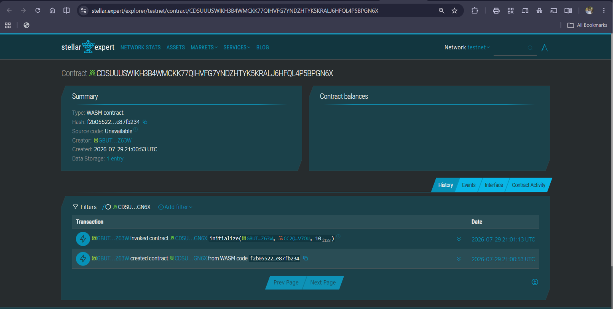
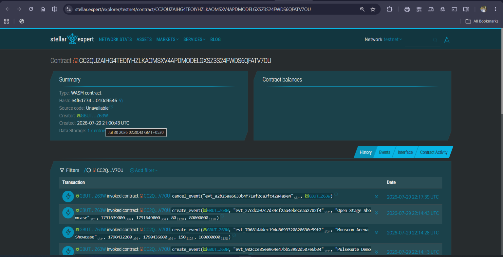
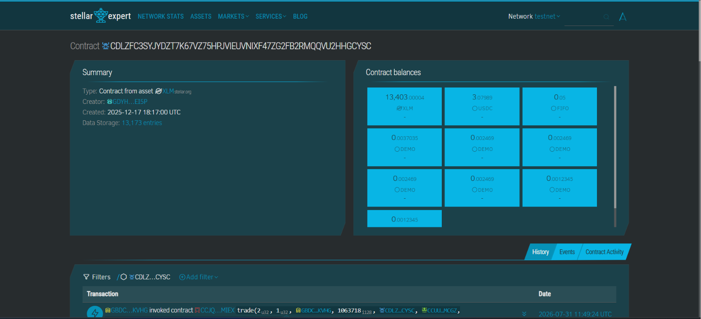
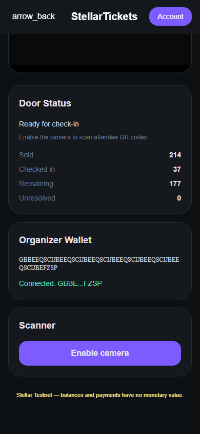

# PulseGate

> **Event tickets people can trust — secure purchases, protected resale, recoverable payments, and verified venue entry on Stellar.**

[](https://github.com/TusharDarsena/stellar_ticket/actions/workflows/ci.yml)

PulseGate is a complete event-ticketing experience for attendees and organizers.
It combines a fast, familiar web app with Soroban contracts that control ticket
sales, XLM escrow, refunds, resale, royalties, and venue entry.

[**Open PulseGate**](https://stellar-gamma-weld.vercel.app/) ·
[**Watch the walkthrough**](https://www.youtube.com/watch?v=0vL_UVSGT3I) ·
[**Browse events**](https://stellar-gamma-weld.vercel.app/events) ·
[**View the contracts**](https://github.com/TusharDarsena/stellar_ticket/tree/main/contracts)

> PulseGate currently uses Stellar Testnet. Testnet XLM has no monetary value.

## Documents

- [**Pitch Deck**](./pulsegate-deck.html)
- [**User Activity Tracking**](./user%20activity.xlsx)
- [**User Feedback**](./feedback.xlsx)
## Current Stellar Testnet contracts

| Wallet Integration | Transaction Signing | Contract Deployment |
|---|---|---|
|  |  |  |

| Contract | Address |
|---|---|
| TicketContract | [`CC2QUZAIHG4TEOIYHZLKAOMSXV4APDMODELGXSZ3S24FWDS6QFATV7OU`](https://stellar.expert/explorer/testnet/contract/CC2QUZAIHG4TEOIYHZLKAOMSXV4APDMODELGXSZ3S24FWDS6QFATV7OU) |
| MarketplaceContract | [`CDSUUUSWIKH3B4WMCKK77QIHVFG7YNDZHTYK5KRALJ6HFQL4P5BPGN6X`](https://stellar.expert/explorer/testnet/contract/CDSUUUSWIKH3B4WMCKK77QIHVFG7YNDZHTYK5KRALJ6HFQL4P5BPGN6X) |
| Testnet XLM SAC | [`CDLZFC3SYJYDZT7K67VZ75HPJVIEUVNIXF47ZG2FB2RMQQVU2HHGCYSC`](https://stellar.expert/explorer/testnet/contract/CDLZFC3SYJYDZT7K67VZ75HPJVIEUVNIXF47ZG2FB2RMQQVU2HHGCYSC) |

Verified TicketContract initialization transaction:
[`343a3e7f707055319503a2256859263563092415830ea6083886077436abb7e0`](https://stellar.expert/explorer/testnet/tx/343a3e7f707055319503a2256859263563092415830ea6083886077436abb7e0).

### First 12 user interactions

The first 12 entries are listedbelow. [View the full list of 65 users and their verified activity here](proofs/proof/README.md).

| User | Interaction | Account | Transaction |
|---:|---|---|---|
| 01 | Primary ticket purchase | [`GDL2YUJZZYZIMZ5GHLY36I2FSEMLJWGNV7VJLNDXW5BLQ4UEMOVDBY4F`](https://stellar.expert/explorer/testnet/account/GDL2YUJZZYZIMZ5GHLY36I2FSEMLJWGNV7VJLNDXW5BLQ4UEMOVDBY4F) | [`ba7651cff4cbc60ca76c4049cfb62aa646b1e0cacf1a7f771afeaeaae080b8db`](https://stellar.expert/explorer/testnet/tx/ba7651cff4cbc60ca76c4049cfb62aa646b1e0cacf1a7f771afeaeaae080b8db) |
| 02 | Primary ticket purchase | [`GAKRN4CSIKQHJWYPZN42JBUGKK5VPOOH6NAHHD5HYU5DEB7JKTKJAC6I`](https://stellar.expert/explorer/testnet/account/GAKRN4CSIKQHJWYPZN42JBUGKK5VPOOH6NAHHD5HYU5DEB7JKTKJAC6I) | [`193b8368a44120794e956871a00add305b97452628e8c0ef61bc75eb0eebc0f5`](https://stellar.expert/explorer/testnet/tx/193b8368a44120794e956871a00add305b97452628e8c0ef61bc75eb0eebc0f5) |
| 03 | Primary ticket purchase | [`GDIZXZGB7M4NMGMR3J6M3SKDHMBP5K65DV2KAHOY5ZRQDC6KIUUPBZDE`](https://stellar.expert/explorer/testnet/account/GDIZXZGB7M4NMGMR3J6M3SKDHMBP5K65DV2KAHOY5ZRQDC6KIUUPBZDE) | [`0c97cba95707a6b2356a1b3923ca55a137261e6d683db77a68f553877bf83912`](https://stellar.expert/explorer/testnet/tx/0c97cba95707a6b2356a1b3923ca55a137261e6d683db77a68f553877bf83912) |
| 04 | Marketplace listing created | [`GCLHT7MDWBZ5G2S4YD3GR4ZAKS2LZDDBHSNKMOLVECGHFULMGRVFFK66`](https://stellar.expert/explorer/testnet/account/GCLHT7MDWBZ5G2S4YD3GR4ZAKS2LZDDBHSNKMOLVECGHFULMGRVFFK66) | [`7bf3c59b15b04735253f4d05c38b8968e2484ddd36a179227cde7aa7812e8235`](https://stellar.expert/explorer/testnet/tx/7bf3c59b15b04735253f4d05c38b8968e2484ddd36a179227cde7aa7812e8235) |
| 05 | Primary ticket purchase | [`GDCJWA6ZQR3UQDKM6JJJJ3E7XUITPRMJMU5RTFALHTY5O43V7EZ2B24Z`](https://stellar.expert/explorer/testnet/account/GDCJWA6ZQR3UQDKM6JJJJ3E7XUITPRMJMU5RTFALHTY5O43V7EZ2B24Z) | [`0033fcdd7a922a219a0e5cd345031af492b2e5f9323f810cb9adbaeac0ce973a`](https://stellar.expert/explorer/testnet/tx/0033fcdd7a922a219a0e5cd345031af492b2e5f9323f810cb9adbaeac0ce973a) |
| 06 | Primary ticket purchase | [`GBN5PXXOEAYH454ZI4MTSKVY4EK3A25FGBSKMBSZ64XXKX7OVM6PWQOZ`](https://stellar.expert/explorer/testnet/account/GBN5PXXOEAYH454ZI4MTSKVY4EK3A25FGBSKMBSZ64XXKX7OVM6PWQOZ) | [`9141fab8e411002662ecfb123a5c7bfda2b5088c410cfdd206782e2d37d67e11`](https://stellar.expert/explorer/testnet/tx/9141fab8e411002662ecfb123a5c7bfda2b5088c410cfdd206782e2d37d67e11) |
| 07 | Marketplace listing created | [`GDKAWM5JRBK3ITDU7LBU5EQZQ26EL4JRDCEOYG3PCXPZSILBUJXVC6JE`](https://stellar.expert/explorer/testnet/account/GDKAWM5JRBK3ITDU7LBU5EQZQ26EL4JRDCEOYG3PCXPZSILBUJXVC6JE) | [`f61a5206899305e2abc616091674634e78d4414cfe9c2f6ace9880b0693352c5`](https://stellar.expert/explorer/testnet/tx/f61a5206899305e2abc616091674634e78d4414cfe9c2f6ace9880b0693352c5) |
| 08 | Cancelled-event refund | [`GCFAGDPA6DEV67RCKPSXMGP46H4WJ7BIEPUV7DQGIFJ5DEPODWN3UPYB`](https://stellar.expert/explorer/testnet/account/GCFAGDPA6DEV67RCKPSXMGP46H4WJ7BIEPUV7DQGIFJ5DEPODWN3UPYB) | [`a79f49297d7a2c328e36fb469be814d8ddb9a64ead178e3b0a77d50e16bee28a`](https://stellar.expert/explorer/testnet/tx/a79f49297d7a2c328e36fb469be814d8ddb9a64ead178e3b0a77d50e16bee28a) |
| 09 | Marketplace resale purchase | [`GALAJ5AHO7FB5VCAF7BHQBLPC2GPBOQMQH2CPQQQRASM7URGVK3PRR2D`](https://stellar.expert/explorer/testnet/account/GALAJ5AHO7FB5VCAF7BHQBLPC2GPBOQMQH2CPQQQRASM7URGVK3PRR2D) | [`3f1ce08ac579edca9fbc944c869ef6790f2a67358894defad1e48d924cd5b4a5`](https://stellar.expert/explorer/testnet/tx/3f1ce08ac579edca9fbc944c869ef6790f2a67358894defad1e48d924cd5b4a5) |
| 10 | Marketplace listing created | [`GBRBS7N7NG2EVTNZQDOBAGFXVQTLDV7TXAI47AMLDX7AIZMLHPKOZK3L`](https://stellar.expert/explorer/testnet/account/GBRBS7N7NG2EVTNZQDOBAGFXVQTLDV7TXAI47AMLDX7AIZMLHPKOZK3L) | [`89a132af153edf364280a078936e0ba98a4aa7746378cf417ae2992540b2dc67`](https://stellar.expert/explorer/testnet/tx/89a132af153edf364280a078936e0ba98a4aa7746378cf417ae2992540b2dc67) |
| 11 | Marketplace resale purchase | [`GDERRR2FTL52RVJPHQNK6JMTPVQNQC5VIGPUVC5NKKJGODP2ZWKRQWM3`](https://stellar.expert/explorer/testnet/account/GDERRR2FTL52RVJPHQNK6JMTPVQNQC5VIGPUVC5NKKJGODP2ZWKRQWM3) | [`c67b151be85cb41d1d79cb9261bf2521cc39d028453c3390a41301bab5beabcf`](https://stellar.expert/explorer/testnet/tx/c67b151be85cb41d1d79cb9261bf2521cc39d028453c3390a41301bab5beabcf) |
| 12 | Marketplace resale purchase | [`GBJLBSF3HR5JV2WF5ILNBA4CKMAZEAFHF722ZPKFUOUN5QVPANRG6DCK`](https://stellar.expert/explorer/testnet/account/GBJLBSF3HR5JV2WF5ILNBA4CKMAZEAFHF722ZPKFUOUN5QVPANRG6DCK) | [`8ef0a1ca0866d61d880d71bbd4d97c7d9b912c150a1696f4b82b5bbcbaaafcd4`](https://stellar.expert/explorer/testnet/tx/8ef0a1ca0866d61d880d71bbd4d97c7d9b912c150a1696f4b82b5bbcbaaafcd4) |

The deployed TicketContract exposes
`mark_used(event_id, ticket_id, expected_owner, organizer)` and stores the
MarketplaceContract above as its trusted resale peer.

## Evaluate PulseGate in 60 seconds

1. Browse the event catalogue and try its search, category, city, and date filters.
2. Open an event to inspect its live availability, policies, venue, map, and calendar actions.
3. Follow the attendee journey through checkout, receipt, My Tickets, resale, and QR entry.
4. Open the Organizer Hub to see private drafts, publication, event management, and check-in.
5. Inspect the current
   [TicketContract](https://stellar.expert/explorer/testnet/contract/CC2QUZAIHG4TEOIYHZLKAOMSXV4APDMODELGXSZ3S24FWDS6QFATV7OU)
   and
   [MarketplaceContract](https://stellar.expert/explorer/testnet/contract/CDSUUUSWIKH3B4WMCKK77QIHVFG7YNDZHTYK5KRALJ6HFQL4P5BPGN6X).

## Product tour

[](https://youtu.be/fFb7GMNdWRI)

The walkthrough covers discovery, event detail, checkout, ticket ownership,
resale, organizer publishing, and QR check-in without requiring local setup.

| Discover events | Event detail |
|---|---|
|  |  |

| Event detail — mobile | Organizer check-in scanner |
|---|---|
|  |  |


## What attendees can do

### Discover and plan

- Browse without signing in.
- Search by event name, venue, or city.
- Filter by category, city, and the next 24 hours, 7 days, or 30 days.
- See sale state, remaining supply, price, venue, city, and local event time.
- Open full descriptions, policies, entry instructions, support details, and
  live contract-verified availability.
- Share events, open their map, add them to Google or Outlook Calendar, or
  download an `.ics` file.

### Sign in and prepare a wallet

- Continue with Google or a six-digit email code.
- Return to the exact protected destination that triggered sign-in.
- Provision one delegated Stellar attendee wallet per account.
- Save a one-time recovery code and restore the same wallet on another device.
- Keep attendee signing separate from the organizer's Freighter wallet.
- Request bounded Testnet XLM funding directly from checkout when needed.

### Purchase with confidence

- Recheck the event's current lifecycle, price, capacity, and supply before payment.
- Review ticket price, estimated network fee, total debit, wallet, and network.
- Simulate the contract transaction before wallet approval.
- Preserve the signed transaction identity before submission so an interrupted
  operation can be resolved without repeating payment.
- Receive a durable receipt with transaction, ticket, owner, amount, fee,
  ledger, network, and Stellar explorer evidence.
- Retry only app synchronization when Stellar has already confirmed the purchase.

### Own, recover, refund, and resell

- Browse upcoming and past tickets with `Active`, `Used`, and `Refunded` states.
- Recover a ticket from its receipt or authoritative contract state when a
  read-model row is delayed.
- Open the original purchase receipt from the ticket library.
- Claim the original ticket price after an organizer cancels an event.
- Create a resale listing with a chosen XLM ask price.
- Cancel an open listing without changing ticket ownership.
- Resolve pending or unknown refund and resale operations without blindly resubmitting them.

### Buy safely on the marketplace

- Browse open listings with event, seller, date, and ask-price context.
- Deep-link directly to a selected listing.
- Prevent attendees from buying their own listing.
- Recheck the listing, ticket owner, event, and price through contract simulation.
- Review the estimated total before wallet approval.
- Settle organizer royalty, seller proceeds, and ticket ownership atomically on Stellar.

### Enter the venue

- Generate a fresh Ed25519-signed QR only after current owner and `Active` status checks.
- Rotate the QR every 30 seconds and reject payloads at an absolute age of 45 seconds.
- Stop generating entry codes at the next validation after transfer, refund, or check-in.

## Repository structure

```text
contracts/                    Soroban Ticket and Marketplace contracts
  ticket/                     Event lifecycle, tickets, escrow, and entry
  marketplace/                Resale listings, royalties, and settlement
frontend/                     React/Vite application
  src/pages/                  Attendee and organizer routes
  src/lib/soroban.ts          Handwritten contract integration boundary
  src/lib/qr.ts               QR construction and local verification
  src/contracts/              Generated TypeScript contract bindings
supabase/                     Read-model schema and Edge Functions
  migrations/                 PostgreSQL schema, RLS, and operation storage
  functions/                  Authenticated wallet and operation services
scripts/deploy.ps1            Coordinated Windows Testnet deployment
docs/                         Architecture, product, and contributor guidance
```

## Run locally

### Prerequisites

- Node.js 22+
- pnpm 10
- Rust with the `wasm32v1-none` target
- Stellar CLI
- A Supabase project for authenticated wallet and recovery flows

```powershell
git clone https://github.com/TusharDarsena/stellar_ticket.git
cd stellar_ticket\frontend
Copy-Item .env.example .env.local
pnpm install --frozen-lockfile
pnpm dev
```

Configure `frontend/.env.local` so contract IDs, network values, RPC, Horizon,
explorer, and Supabase all describe one coordinated Testnet environment.

### Checks

```powershell
# Frontend
cd frontend
npm test
npm run lint
npm run build

# Contracts
cd ..\contracts
cargo fmt --check
cargo test
cargo build --target wasm32v1-none --release
```

### Coordinated Testnet deployment

```powershell
powershell -ExecutionPolicy Bypass -File .\scripts\deploy.ps1 -SetSupabaseSecrets
```

This builds both contracts, regenerates their TypeScript bindings, deploys and
initializes the pair, updates the frontend configuration, and can synchronize
the linked Supabase secrets.

### CI/CD

GitHub Actions runs the project CI from `.github/workflows/ci.yml` on repository
updates. The pipeline validates frontend and contract work before changes are
merged. Vercel handles the hosted web deployment after the repository is updated.
Keep local screenshot captures, Supabase CLI state, and patch scratch files out
of commits so CI only processes source, configuration, and documentation that
belongs in the app. The three curated images in `screenshots/proofs/` are the
exception because the contract proof table above embeds them directly.

## What organizers can do

### Build publication-ready events

- Start with a private, recoverable draft and stable event ID.
- Add title, summary, description, poster, category, organizer identity, support
  details, public links, and attendee guidance.
- Configure timezone-aware start and end times.
- Add venue, address, city, map, entry, accessibility, age, and prohibited-item information.
- Set contract-backed capacity and General Admission price in XLM.
- Preview the public event while editing and track publication readiness.
- Protect unsaved work, keep offline edits in the current page, and detect
  concurrent draft revisions.
- Explicitly bind the intended organizer wallet before publication.
- Delete unused private drafts before they reach Stellar.

### Publish and operate on Stellar

- Connect Freighter without mixing it with the attendee wallet.
- Preflight and simulate `create_event` before approval.
- Persist the signed publication hash and recover interrupted confirmation.
- Receive a publication receipt with event, organizer, transaction, and explorer details.
- View private drafts and published events together in the Organizer Hub.

### Manage a published event

- Monitor tickets sold, sell-through, gross primary sales, and XLM held in escrow.
- Edit public descriptions, support and entry guidance, accessibility details,
  age restrictions, venue notes, and maps.
- Keep venue identity editable before the first sale and locked afterward.
- Open the public event directly from its management page.
- Review publication and lifecycle activity.
- Cancel an event with a public reason, enabling attendee-initiated refunds.
- Complete an eligible event and release its remaining escrow.
- Recover interrupted cancellation or fund-release operations.

### Run secure check-in

- Open an event-scoped camera scanner only when authoritative readiness checks pass.
- Require the exact event organizer's Freighter wallet.
- Enforce the contract's door window from two hours before the event until its end.
- Validate QR shape, age, and Ed25519 signature locally.
- Recheck the ticket's event, current owner, and status on Stellar.
- Submit organizer-authorized `mark_used` and wait for confirmation before admission.
- Distinguish expired, invalid, transferred, refunded, wrong-event, and already-used tickets.
- Track sold, checked-in, remaining, and unresolved counts at the door.
- Resolve an uncertain signed check-in before allowing another scan.

## Experience across the app

- Responsive desktop layouts and a dedicated mobile bottom navigation.
- Direct-link, refresh, Back, and protected-route intent handling.
- Thirty-second event, ticket, and marketplace refresh cycles.
- Loading skeletons and useful empty, offline, unavailable, and recovery states.
- Semantic headings, labelled controls, visible keyboard focus, touch-friendly
  targets, live status announcements, and reduced-motion support.
- Keyboard-dismissable review dialogs and focused transaction approval states.

## Trust and recovery are visible

PulseGate uses four authority states wherever a decision depends on Stellar:

| State | Meaning |
|---|---|
| **Checking** | PulseGate is reading or resolving current Stellar state. |
| **Confirmed** | A fresh authoritative read supports the action now. |
| **Historical** | A recorded contract event or transaction receipt proves the result. |
| **Unavailable** | Authority could not be established, so the affected action stays disabled. |

Supabase catalogue rows are useful previews, never purchase, transfer, refund,
fund-release, or admission authority.

## Ticket lifecycle

```text
Private draft
    |
    v
Publish event on Stellar
    |
    v
Purchase ticket ---------> XLM held in event escrow
    |
    +----> Resale listing ----> Contract sale + royalty + ownership transfer
    |
    +----> Cancelled event ---> Attendee refund
    |
    +----> Fresh signed QR ---> Organizer scan ---> Ticket marked Used
    |
    v
Event completed ---------> Remaining escrow released to organizer
```

## ASCII architecture diagram

```text
                                      PULSEGATE

  +--------------------+       +-------------------------+       +--------------------+
  | Guest / Attendee   |------>| React + Vite Web App    |<------| Organizer          |
  | Supabase Auth      |       | responsive role flows   |       | Freighter wallet   |
  +---------+----------+       +------------+------------+       +---------+----------+
            |                               |                              |
            v                               v                              |
  +--------------------+       +-------------------------+                 |
  | Dfns delegated     |       | Handwritten adapters    |<----------------+
  | attendee wallet    |       | soroban / QR / wallet   |
  +---------+----------+       +------------+------------+
            |                               |
            |                    authoritative reads and transactions
            |                               v
            |                  +---------------------------+
            |                  | Stellar RPC + Horizon     |
            |                  +-------------+-------------+
            |                                |
            |               +----------------+----------------+
            |               |                                 |
            |               v                                 v
            |     +----------------------+        +--------------------------+
            |     | TicketContract       |<------>| MarketplaceContract      |
            |     | events and tickets   |        | listings and royalties   |
            |     | XLM escrow and entry |        | restricted transfer      |
            |     +----------+-----------+        +--------------------------+
            |                |
            v                v
  +--------------------------------------------------------------------------+
  | Supabase Auth + PostgreSQL read model + seven durable Edge Functions     |
  | discovery, drafts, receipts, operation recovery, post-confirmation sync  |
  +--------------------------------------------------------------------------+

  State-changing order:
  validate -> simulate -> sign -> persist identity -> submit -> confirm on Stellar
           -> synchronize Supabase -> invalidate affected reads
```

## Where truth lives

| Capability | Stellar controls | Supabase accelerates |
|---|---|---|
| Event publication | Organizer authorization and `create_event` | Private drafts and searchable metadata |
| Primary purchase | Price, supply, lifecycle, mint, and XLM escrow | Durable operation and ticket-library projection |
| Refund | Owner, cancelled event, ticket state, and XLM return | Resolution and receipt presentation |
| Resale | Listing, owner, event, royalty, settlement, and transfer | Open-listing discovery and recovery |
| QR display | Current owner and ticket status | Event presentation |
| Venue entry | QR-bound owner, event, organizer, door window, and `mark_used` | Durable receipt and statistics |
| Fund release | Event end, lifecycle, organizer, and escrow | Organizer operation history |


## Contract functions

### TicketContract

| Function | Authorized caller | Purpose |
|---|---|---|
| `initialize(admin, marketplace_address, xlm_token)` | Admin | Stores trusted deployment addresses once. |
| `create_event(organizer, event_id, name, date_unix, end_unix, capacity, price_per_ticket)` | Organizer | Creates an active event with lazy ticket minting. |
| `cancel_event(event_id, organizer)` | Event organizer | Cancels an active event and enables pull-based refunds. |
| `purchase(event_id, buyer, ticket_id)` | Buyer | Mints one active ticket and moves its price into escrow. |
| `release_funds(event_id, organizer)` | Event organizer | Completes an eligible event and releases its escrow. |
| `refund(ticket_id, attendee)` | Current owner | Refunds an eligible ticket at its primary price. |
| `restricted_transfer(ticket_id, new_owner)` | Trusted marketplace | Transfers an active ticket through the resale contract. |
| `mark_used(event_id, ticket_id, expected_owner, organizer)` | Event organizer | Rechecks event, owner, status, and door window before entry. |
| `get_ticket(ticket_id)` | Read-only | Returns authoritative ticket ownership and status. |
| `get_event(event_id)` | Read-only | Returns authoritative event terms, supply, and lifecycle. |
| `get_escrow_balance(event_id)` | Read-only | Returns contract-accounted event escrow. |
| `get_marketplace()` | Read-only | Returns the trusted MarketplaceContract. |
| `get_xlm_token()` | Read-only | Returns the trusted XLM SAC. |

### MarketplaceContract

| Function | Authorized caller | Purpose |
|---|---|---|
| `initialize(admin, ticket_contract_address, royalty_rate)` | Admin | Stores the TicketContract and royalty percentage once. |
| `list_ticket(seller, listing_id, ticket_id, event_id, ask_price)` | Seller | Creates a seller-scoped open listing. |
| `buy_listing(seller, listing_id, buyer)` | Buyer | Settles royalty and proceeds, then transfers ownership. |
| `cancel_listing(seller, listing_id)` | Original seller | Cancels an open listing. |
| `get_listing(seller, listing_id)` | Read-only | Returns a seller-scoped listing and state. |

### Contract events

| TicketContract | MarketplaceContract |
|---|---|
| `ev_create` — event created | `mk_list` — listing created |
| `tk_buy` — ticket purchased | `mk_sold` — listing sold |
| `ev_rel` — escrow released | `mk_cancel` — listing cancelled |
| `ev_cancel` — event cancelled | |
| `tk_refund` — ticket refunded | |
| `tk_xfer` — ownership transferred | |
| `tk_used` — ticket checked in | |

## Security design

- Every externally supplied economic actor must authorize the contract call.
- Organizer operations match the signer against the event's on-chain organizer.
- XLM and cross-contract addresses are stored once during initialization.
- Economic paths use checked arithmetic and checks-effects-interactions ordering.
- Marketplace settlement derives royalty authority from the authoritative event.
- Raw attendee secrets never enter browser storage, Zustand, Supabase, logs, or source.
- Signed hashes are persisted before resolution; unknown states block repeat submission.
- QR signature validity never replaces current on-chain owner and status checks.

## Technology

| Layer | Technology |
|---|---|
| Contracts | Rust, Soroban SDK 25.3.1, `wasm32v1-none` |
| Frontend | React 19, TypeScript 6, Vite 8, Tailwind CSS 4 |
| Stellar | Stellar SDK 15, generated contract clients, RPC, Horizon |
| Attendee | Supabase Auth and Dfns delegated wallet |
| Organizer | Freighter |
| Data and recovery | PostgreSQL, RLS, Supabase Edge Functions |
| QR | Ed25519, `qrcode.react`, `html5-qrcode` |
| Testing | Vitest, Testing Library, Playwright, Rust contract tests |

Deeper implementation details live beside the code:

- [Soroban contracts](contracts/)
- [Frontend contract adapter](frontend/src/lib/soroban.ts)
- [QR construction and verification](frontend/src/lib/qr.ts)
- [Supabase migrations](supabase/migrations/)
- [Durable Edge Functions](supabase/functions/)
- [Coordinated deployment script](scripts/deploy.ps1)

## Verification

- **56/56 frontend tests pass across 16 test files.**
- Frontend lint and the production TypeScript/Vite build pass.
- CI runs contract checks, Rust tests, frontend lint/build, and Vitest separately.
- Desktop and mobile captures cover the attendee and organizer journeys.
- The deployed TicketContract interface and stored MarketplaceContract were
  verified through read-only Stellar Testnet calls.

## Contributing

1. Read [`AGENTS.md`](AGENTS.md) and the relevant area guide.
2. Create a focused branch.
3. Keep generated bindings generated.
4. Add focused tests for authoritative behavior.
5. Open a pull request with verification evidence.

---

Built for the Stellar ecosystem with a simple rule: **tickets should be easy to
use and hard to fake.**
